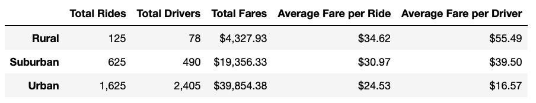
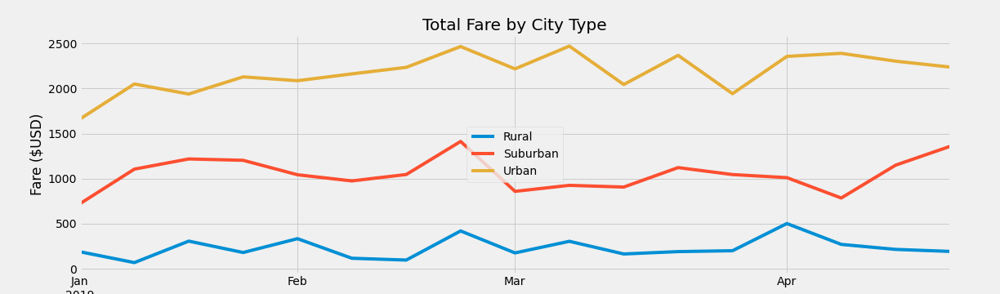

# PyBer Analysis

##    Overview of the analysis: 
The current alalysis objective is to review all the rideshare data from January to early May of 2019 to discover 

##    Results: 
### Summary Dataframe

It is clear that the total rides in Urban areas are the greatest compared to rural or suburban. However, this is inversely correlated with the average fare per ride and per driver. The difference is very significant, for example, the average fare per driver in a rural area is 70,14% more than a driver from an urban area.

## Summary Chart

The total fares for each city type have a very similar trend during the January to early May of 2019 period.  Nevertheless, it does not reflect the difference in the needs of customers and population sizes.

##    Summary: 
- Rural areas have low total fares $, as it does not take into account the number of drivers and/or riders.
- Rural areas have very stable behaviour during the year, which allows the planning process to be accurate and discover opportunities when there are lows to motivate customers
- Rural areas have incomplete data information which makes it not accurate.
